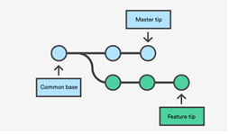

[Back To Topic List](README.md)

# Git commands and terminology:

## Repository
A repository is the location where the project files are stored. A git repository will help to keep track of the changes made to these files

An existing directory can be converted to a git repository by using the following command

```
git init
```


## Clone
Clone if the local copy of a remote repository. A developer can create a clone of a repository in his local machine to analyze, develop and test the code

```
git clone
```

## Fork
A fork is the copy of a remote repository stored in github or a git repository hosting service. The difference between clone and fork is that a cloning repository will create a copy in the local machine while forking a repository will create a copy in a git hosting service like github.

## Branch
A branch helps to separate a specific set of changes from others. Developers can create a branch to keep track of a particular feature that is being added to the application. For example an ‘authentication’ branch can be created to keep track of all the changes made to implement a user registration and login feature in a web application

A new branch can be created using the following commands

```
Git branch newBranch

Git checkout -b newBranch
```

## Commit
A commit is the snapshot of the state of files. A developer should commit his code to the appropriate branch to make sure it is tracked. 
		
A commit can be made using the following commands

```
Git add .

Git commit

Git commit -a

Git commit -m

Git commit -am
```
ADDing new changes.	

## Merge
Merging  is Git's way of putting together a united history again. The git merge command allows you to take independent lines of development made by a git branch and merge it into a single branch.	

Example:- 
We have a new branch feature that is based off the master branch. We now want to merge this feature branch into master.

   

Using this command we have a new branch feature that is based off the master branch. We now want to merge this feature branch into master.


## Checkout

The git checkout command lets you navigate between the branches created by git branch. 

```	
 git checkout -b <branchname>  

git checkout -b <branchname>  

git checkout <remotebranch> origin/<remotebranch> 
```

[Back To Topic List](README.md)
